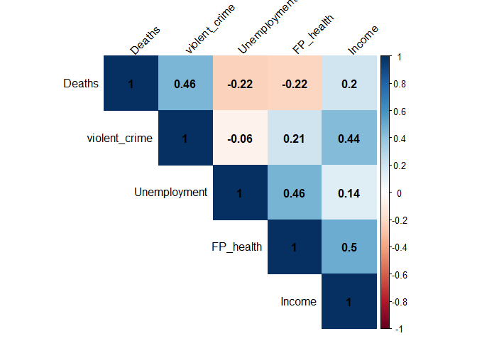
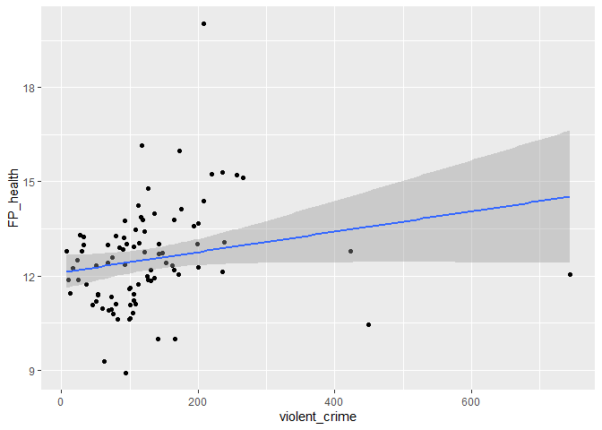

Social and Economic factors of Counties in Minnesota
================
Keenan Schissel
2/23/2021

## Abstract

The state of Minnesota is ranked number 10 in the United States for
Health care and ranked number 18 for its economic status. These are some
very great and very high numbers but how do the counties fair on an
individual level? The number 1 county in overall health in Minnesota as
of right now is Carver county while the lowest ranked county is Mahnomen
county. I plan to do an exploratory data analysis and compare these two
counties in their Social and economic factors and their quality of life
to see if there is a correlation between the two. The data set that i
will be obtaining this information from is County Health Rankings and
Roadmaps. With my results from this, I plan to see whether or not the
economic and social factors in counties play a role in quality of life

## Introduction

There are several counties that can be considered either above or below
the average standard of living. These counties can be usually seen by
the comparison of the counties overall income, unemployment and the
crime rate that happens within their community. This has led to a big
conclusion among people that these factors tie within the quality of
life that these people in a certain have to endure. But is this entirely
true? Perhaps there may be other leading causes just beside these
factors. In my hypothesis, I believe that these factors have the most
impact on dictating the quality of life for a county. If my hypothesis
is to be true, then we would be able to narrow down the immediate impact
factors and try to help these lower quality of life counties across
america. \#\# Methods

### Data Acquisition

\-I found my data on countyhealthrankings.org -I went to look at the
county health rankings only in Minnesota -Then I proceeded to download
all the Minnesota data by choosing the excel sheet and click download
-after the data was download i moved it over into my data folder for R
studio Finally, I read the data in R

### Data Preperation

  - For my data I used Rsudio version 1.3.1093 (Rstudio Team 2020) -This
    version can be found in R version 4.03(R Core Team 2020) -I
    downloaded my data from excel which was obtained by usin gthe
    packages dplyr (Wicham et. al 2020) and readxl (Wickham and Bryan
    2019) -Then I made read\_excel become the function download data
    which allows the excel file to be readable in R \_Finally I used the
    glimpse function in order to preview the data and then used the
    transmute function to use the datasets i want to compare for my
    final analysis

## Results

<!-- --><!-- --><!-- -->

## Discussion

In conclusion Figure 1 and 2 show that there is quite a significant
correlation between violent crimes and fair or poor health in a county
and also a somewhat strong relation between Income and unemployment .
This can imply that Social and economic factors have a impact on ones
quality of life in a certain county making my original hypothesis true.
Now knowing these results we can try and further help these lower social
and economic counties in order to help improve their quality of life so
they don’t keep falling behind the standard of living. \#\# Literature
Cited

University of Wisconsin Population Health Institute. County Health
Rankings 2020. Available at www.countyhealthrankings.org. Accessed
3/4/2020.

R Core Team (2020). R: A language and environment for statistical
computing. R Foundation for Statistical Computing, Vienna, Austria. URL
<https://www.R-project.org/>.

RStudio Team (2020). RStudio: Integrated Development Environment for R.
RStudio, PBC, Boston, MA URL <http://www.rstudio.com/>.

Hadley Wickham, Romain François, Lionel Henry and Kirill Müller (2020).
dplyr: A Grammar of Data Manipulation. R package version 1.0.2.
<https://CRAN.R-project.org/package=dplyr>

Hadley Wickham and Jennifer Bryan (2019). readxl: Read Excel Files. R
package version 1.3.1. <https://CRAN.R-project.org/package=readxl>
